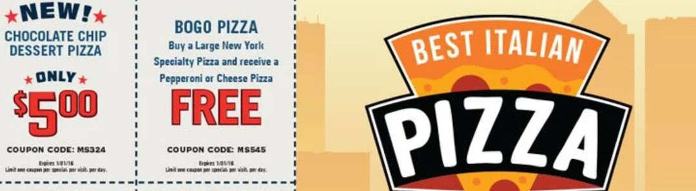
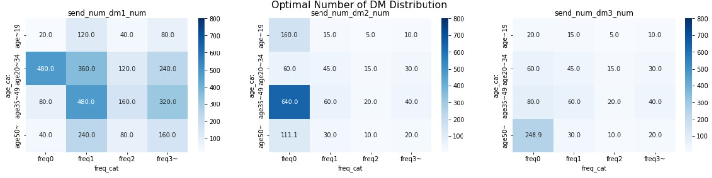

# Project Background

Imagine you are tasked to decide the amount of budget for the use of direct mail marketing of one of your EC sites. 

We consider starting a coupon campaign attached to direct mail. The budget is to cover the redeem of coupons.

 

There are three possible types of direct mail + coupon:
- no direct mail (status quo)
- direct mail with 10 USD coupon
- direct mail with 20 USD coupon
We assume that we already know how likely the customers are to buy from our EC site once they receive our coupons (including the case of no coupon), in a form of probabilities (see "Data" section below).

 

The marketing team worries the possible reputation loss when the coupons were only given to the specific customer groups, so would like to send coupons to some proportion of customers no matte what (i.e. 'fairness'). 

This approach will also helpful for the future campaign planning because we can collect the customers reaction to coupons and refine the estimates of conversion probabilities.

 

As we knew the probabilities of the conversion by each coupon amount per customer segmentation through preliminary analyses, we concluded we would plan the coupon distributions in advance.

The planning will be done through the numeric optimization using Python library named 'Pulp', which can very easily handle the linear programming optimization problems.

 

  

# Data
Data was copied from this repository (https://github.com/ohmsha/PyOptBook/tree/main/4.coupon). I imagine this data is artificially created one for demonstration.

There are two data files used:

- customer data ("./data/external/customers.csv")
- conversion probability  data ("./data/external/visit_probability.csv")

## Customer data

| Name        | Description                                                                                                                     |
|-------------|---------------------------------------------------------------------------------------------------------------------------------|
| customer_id | Unique ID of customers (An integer between 1-5000).                                                                                                 |
| age_cat     | Age category of customers:  - age\~19  - age20\~34  - age35\~49  - age50\~                                                              |
| freq_cat    | Category by number of conversion in last year:  - freq0: No conversion  - freq1: Once  - freq2: Twice  - freq3\~: Three times or more |

There are 5,000 customers in the data.

 

## Conversion probability data

| Name       | Description                                                                                                                      |
|------------|----------------------------------------------------------------------------------------------------------------------------------|
| age_cat    | Age category of customers:  - age\~19  - age20\~34  - age35\~49  - age50\~                                                               |
| freq_cat   | Category by number of conversion in last year:  - freq0: No conversion  - freq1: Once  - freq2: Twice  - freq3~: Three times or more |
| segment_id | Unique ID of customer segment for unique combination of age_cat and freq_cat (An integer between 1-16).                                    |
| prob_dm1   | Probability of conversion when customers receive no direct mail *(dm1)*.                                                                      |
| prob_dm2   | Probability of conversion when customers receive a direct mail with 10 USD coupon *(dm2)*.                                                                  |
| prob_dm3   | Probability of conversion when customers receive a direct mail with 20 USD coupon *(dm3)*.                                                                  |

  

# Model
## Define notations
Let  denote the probability to send the customer segment  the direct mail type , where  and , which means there are 16 different types of customers (in this time's example, defined by customer age group and last year conversion frequency group; and three different types of direct mail.

Each direct mail type represents:
- : No direct mail sent (status quo).
- : A direct mail with 10 USD coupon sent.
- : A direct mail with 20 USD coupon sent.

The same index notations will be used hereinafter.

Let  denote the probability of conversion when the customers belonging to segment  receive the direct mail of type .

Let  denote the amount of coupon attached to each direct mail types. We will ignore the non-coupon costs in this study. Then, .

Let  denote the number of customers belonging to the segment .

 

## Decision variables

The variables to change in the optimization (so-called "decision variables") in this project are:
-  (probability to send the customer segment  the direct mail type )
-  (maximum budget to cover the redeemed coupons)

 

## Formulate objectives and constraints
### Objective: maximizing the expected profit
We are happiest when the budget creates the most increase in profit. For simplicity, the profit in this project is to be defined:

 

 

### Constraint 1: the sum of probabilities to the same segment for all direct mail type is 1

  

### Constraint 2: expected total amount of coupon redeemed is within budget
Since we only care about the amount the coupon is actually redeemed, the amount is the number of (expected) conversion, rather than the number of coupons sent.

  

### Constraint 3: letting any types of direct mail cover at least 10% of customers of every segment

  

# Results
## Fixed budget
For the ease of the problem, let's first remove some flexibility and define the followings as exogenous parameters:
- , , and .
- 
- 

This notebook (./opt_step_by_step.ipynb) gives the modeling walkthrough using `Pulp`. 

Here's the heatmap of the distribution probabilities ().

The results indicate that for the group with no purchase last year except for age20\~34, we should send some coupon and particularly the group age50\~ will appreciate the higher valued coupon more. 

And here's the heatmap of the count of mails ().

 

Let's check how much we got overall net increase of the profit against the status quo.

 

The value is -217 USD. So, this means that limiting the budget at 10,000 USD will not make money even with the best coupon distribution plan. Ugh!

 

## Variable budget and finding optimal
Then let's move the budget amount.

- , , and .
- 

 

The notebook (./opt_all.ipynb) gives the code of this optimization.

The optimized budget amount is 18,900 USD.

In this case, the increase of the profit against the status quo is 400 USD. Alright, it is positive this time.

  

# Let's Review the Results
## What's happening before and after the optimal budget amount.

To visualize how changing budget amount maximizes the profit, the following analysis is based on the repeated optimization using the same logic on every 1,000 USD increment from 5,000 USD to 30,000 USD.

The profit increase hits the ceiling at 18,900 USD and no longer grows as the budget is added. This means the budget is no longer used for coupon and left without untouched, because sending coupon to more customers will not add profit but let us lose money.

Of course, this is not a good thing considering the untouched budget can be used for the purposes other than this coupon campaign. So, it would be better to give just 18,900 USD for this campaign.

 

## Isn't ROI too low in the case study?

Actually it is. It was 2.15% against the investment of 18,900 USD, which is 400 USD. This amount of return against as much investment as 18,900 USD is just a joke--particularly so when we remember we did not take the non-coupon cost or indirect cost out of consideration in this study.

Based on this analysis, just giving up the plan is an idea: we will be a lot better off than executing plan and being disappointed later.

Another considerations may come if we:
- try to increase unit sales. This is actually a big game changer. Changing unit sales from 30 USD to 40 USD will raise the ROI up to 25% (budget: 45,700 USD, profit increase: 11,500 USD.) So, efforts to increae the customer spending when they buy something from us will be largely paid off. 
- take this as a "door-knocking" campaign and believe they will come back more in the future. We may be able to take this return-to-shop effect if we incorporate the LTV (Lifetime Value) as a basis of our optimization study. Of course, it will require more assumptions and preliminary analyses.
- do an adjustment of coupon value. This should be followed by the change of conversion probabilities; as a matter of course, it is natural to believe the coupon value changes cause shifts of their conversion probabilities.
- do a better job in customer segmentation. Again this should lead to the redraft of conversion probabilities.

 

## Where's the modeling opportunities?
We need modeling in the calculation of the conversion probabilities. In the study above, we were given the probability table but it is something we can get only after some kind of analyses.

Also, currently we only use "age" and "last year frequency" as the 'explanatory variables' of the background models, but we can elaborate more here and get more granular probabilities determination. 

The better jobs the background models do in the customer targeting, we are more likely to have better amount in the ROI.

Reversely, we may be able to define the minimally-required modeling accuracy to hit the expected ROI. This approach may give more satisfactory outcomes in senses that:
- we can make better communications with business-side stakeholders. The modeling metrics (e.g. accuracy, RSME etc.) are not a part of life for them but ROI is.
- we can define our performance baseline we want to beat in the modeling as more visible and meaningful.

 

## Heads-up when doing modeling.
What we should worry here is the probabilities of conversion when the coupons will MAKE the customers consider of consuming coupons and buying something. It can be different from the ones the model PREDICTS from some observations.

A famous example is <a href="https://www.wnycstudios.org/podcasts/otm/articles/spurious-correlations">Deaths by Swimming Pool Drowning vs. Nicholas Cage Films</a>.

Per some study appeared in the link above, "the number of people who drowned by falling into a swimming-pool" and "the number of files Nicholas Cage appears in" is highly correlated. This means if we know the number of files with Nicholas, we (may) predict the number of drowns in the swimming pool; but it never means if we reduce the number of films with Nicholas, it can reduce the number of drowns. Nicholas's contribution can predict the accidents but not the cause of it.

In the coupon study, we must tackle the same possible disjoint, and answer if the coupon amount causing and driving the conversions? The most widely accepted approach to answer this question the most accurately is doing the randomized control trial. In the coupon case, before we run the optimization study, we stochastically assign the direct mail types to the customers and see how the results differ between the assignment groups.

As known well, this approach has a lot of shortcomings including the costs, loss of opportunities during the trial, limitation in the future change of the options etc., then hopefully we want to get them through the data we already got in the past.

This topic is more about the "causality" analysis, then I would like to leave to another document.

 
